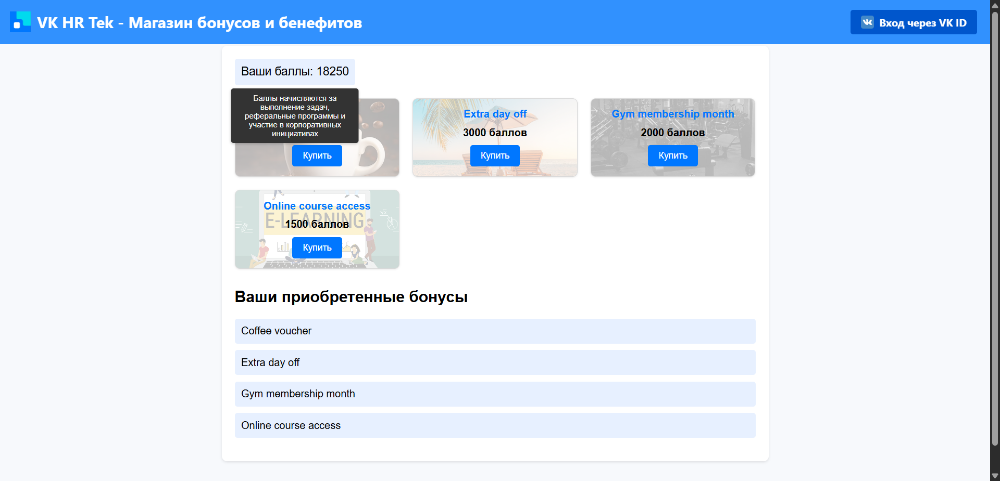

# VK HR Tek - Магазин бонусов и бенефитов

Веб-приложение для просмотра и покупки бонусов за баллы.

## Установка

1. Клонируйте репозиторий:
   ```bash
   git clone https://github.com/geraltAtc/VK-Project.git
2. Установите зависимости:
   ```bash
   pip install flask
3. Запустите:
   ```bash
   python app.py
4. Откройте http://127.0.0.1:5000/.

## Превью

### Десктопная версия




### Мобильная версия

